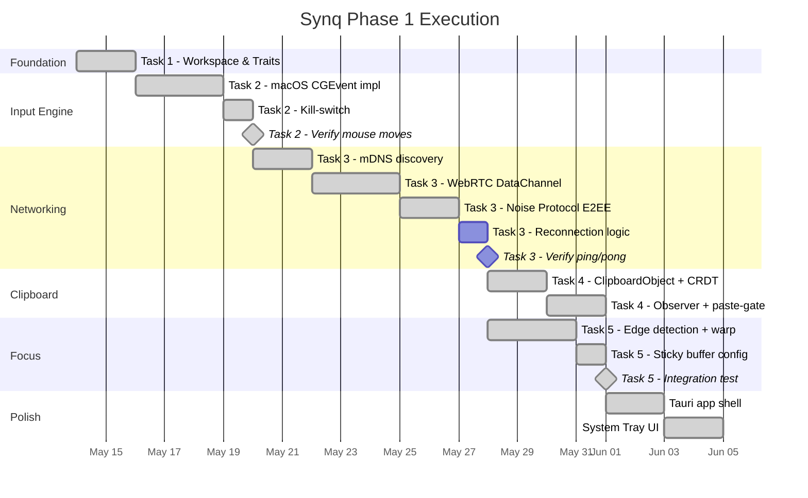

# Synq Phase 1 — Implementation Plan

> Cross-platform input & clipboard continuity. Make two machines feel like one.

---

## 1. Product Vision Recap

| Constraint | Target |
|---|---|
| **Latency** | <20ms end-to-end for input events |
| **Privacy** | Zero-knowledge; all traffic E2EE via Noise Protocol |
| **Reliability** | Sub-second reconnection; survives Wi-Fi toggle |
| **Platforms** | macOS (first) → Windows (second) |
| **UX** | Invisible — feels like a single extended desktop |

---

## 2. Crate Architecture

```
synq/
├── Cargo.toml              # Workspace root
├── crates/
│   ├── synq-core/          # Shared types, config, error handling
│   │   └── src/lib.rs
│   ├── synq-input/         # Input engine — trait + platform impls
│   │   ├── src/
│   │   │   ├── lib.rs      # InputEngine trait
│   │   │   ├── macos.rs    # macOS HID implementation
│   │   │   ├── windows.rs  # Windows HID implementation
│   │   │   └── killswitch.rs
│   │   └── Cargo.toml
│   ├── synq-clipboard/     # CRDT clipboard engine
│   │   ├── src/
│   │   │   ├── lib.rs      # ClipboardEngine trait
│   │   │   ├── observer.rs # Platform clipboard watchers
│   │   │   ├── crdt.rs     # CRDT store (automerge)
│   │   │   └── schema.rs   # ClipboardObject definition
│   │   └── Cargo.toml
│   ├── synq-net/           # Networking layer
│   │   ├── src/
│   │   │   ├── lib.rs      # NetLayer trait
│   │   │   ├── discovery.rs # mDNS + signaling fallback
│   │   │   ├── webrtc.rs   # WebRTC DataChannel transport
│   │   │   ├── noise.rs    # Noise Protocol handshake
│   │   │   └── reconnect.rs # Reconnection state machine
│   │   └── Cargo.toml
│   ├── synq-focus/         # Focus arbitration
│   │   ├── src/
│   │   │   ├── lib.rs      # FocusArbiter trait
│   │   │   ├── edge.rs     # Screen-edge detection
│   │   │   ├── warp.rs     # Cursor warp logic
│   │   │   └── buffer.rs   # Sticky-edge virtual buffer
│   │   └── Cargo.toml
│   └── synq-app/           # Application shell (Tauri)
│       ├── src-tauri/
│       │   └── src/main.rs # Orchestrator — wires all crates
│       ├── src/            # Tauri frontend (settings UI)
│       └── Cargo.toml
└── README.md
```

### Why This Structure

- **Workspace crates** — each module is independently testable and compilable
- **Trait-based injection** — `synq-input` defines `InputEngine`; macOS/Windows are swapped at compile time via feature flags
- **Clean dependency graph** — `synq-app` depends on all crates; crates never depend on each other except through `synq-core`

---

## 3. Dependency Matrix

### Core Dependencies

| Crate | Purpose | Version Strategy |
|---|---|---|
| `tokio` | Async runtime | `1.x` (stable) |
| `serde` / `serde_json` | Serialization | `1.x` |
| `tracing` | Structured logging | `0.1.x` |
| `thiserror` / `anyhow` | Error handling | Latest |
| `uuid` | Unique IDs | `1.x` |
| `chrono` | Timestamps | `0.4.x` |

### Per-Module Dependencies

| Module | Crate | Purpose |
|---|---|---|
| **synq-input (macOS)** | `core-graphics` | CGEvent input simulation |
| **synq-input (macOS)** | Karabiner-DriverKit-VirtualHIDDevice | True Virtual HID (optional upgrade) |
| **synq-input (Windows)** | `windows` | Win32 SendInput API |
| **synq-input (Windows)** | `windows-drivers-rs` | UMDF virtual HID (Phase 1b) |
| **synq-clipboard** | `arboard` | Cross-platform clipboard access |
| **synq-clipboard** | `automerge` | CRDT document store |
| **synq-clipboard** | `clipboard-watcher` | Async clipboard monitoring |
| **synq-net** | `webrtc` (webrtc-rs) | WebRTC DataChannels (v0.17.x) |
| **synq-net** | `snow` | Noise Protocol handshake |
| **synq-net** | `mdns-sd` | mDNS service discovery |
| **synq-focus** | `core-graphics` (macOS) | Screen geometry queries |
| **synq-focus** | `windows` (Windows) | Monitor enumeration |
| **synq-app** | `tauri` 2.x | Application shell |

---

## 4. Task Breakdown

### Task 1: Architectural Foundation & Project Setup

**Goal:** Runnable workspace with all crates, trait definitions, and cross-compilation targets.

#### Steps

1. Initialize Cargo workspace at `/Users/alveis/Projects/Hydratik/synq/`
2. Create all 6 crate directories with `Cargo.toml` and `src/lib.rs` stubs
3. Define core traits:

```rust
// synq-core: shared types
pub struct DeviceId(pub uuid::Uuid);
pub struct ScreenGeometry { pub width: u32, pub height: u32, pub x: i32, pub y: i32 }
pub struct InputEvent { pub kind: InputEventKind, pub timestamp: u64 }
pub enum InputEventKind { MouseMove { dx: i32, dy: i32 }, MouseButton { .. }, KeyDown { .. }, KeyUp { .. }, Scroll { .. } }

// synq-input: InputEngine trait
pub trait InputEngine: Send + Sync {
    fn inject_event(&self, event: &InputEvent) -> Result<()>;
    fn grab_input(&self) -> Result<()>;      // capture local input
    fn release_input(&self) -> Result<()>;   // release local input
    fn emergency_kill(&self) -> Result<()>;  // kill switch
}

// synq-net: NetLayer trait
#[async_trait]
pub trait NetLayer: Send + Sync {
    async fn connect(&mut self, peer: &PeerInfo) -> Result<()>;
    async fn send(&self, msg: &[u8]) -> Result<()>;
    async fn recv(&self) -> Result<Vec<u8>>;
    async fn disconnect(&self) -> Result<()>;
    fn is_connected(&self) -> bool;
}

// synq-clipboard: ClipboardEngine trait
#[async_trait]
pub trait ClipboardEngine: Send + Sync {
    async fn start_observing(&mut self) -> Result<()>;
    async fn on_remote_update(&mut self, obj: ClipboardObject) -> Result<()>;
    fn get_current(&self) -> Option<&ClipboardObject>;
}

// synq-focus: FocusArbiter trait
pub trait FocusArbiter: Send + Sync {
    fn check_edge(&self, cursor_x: i32, cursor_y: i32) -> Option<FocusSwitchCommand>;
    fn apply_warp(&self, cmd: &FocusSwitchCommand) -> CursorPosition;
}
```

4. Set up cross-compilation in `.cargo/config.toml`:

```toml
[target.x86_64-pc-windows-msvc]
linker = "lld-link"

[target.aarch64-apple-darwin]
# native on Apple Silicon
```

5. Add CI-ready `justfile` or `Makefile` with:
   - `check-all` — clippy + check for both targets
   - `test-all` — run all unit tests
   - `build-macos` / `build-windows`

**Deliverable:** `cargo check` passes for all crates; traits compile; README documents the workspace.

---

### Task 2: Virtual HID Implementation

**Goal:** Move the mouse and type keystrokes on the target OS, verified to work with full-screen apps.

#### Strategy: Two-Tier Approach

| Tier | macOS | Windows | Trade-off |
|---|---|---|---|
| **Tier 1 (MVP)** | `CGEvent` via `core-graphics` crate | `SendInput` via `windows` crate | Fast to ship, needs Accessibility perms |
| **Tier 2 (Upgrade)** | Karabiner-DriverKit-VirtualHIDDevice | UMDF via `windows-drivers-rs` | True HID, bypasses app-level restrictions |

> [!IMPORTANT]
> **Start with Tier 1.** CGEvent and SendInput are well-understood, have mature Rust bindings, and work for 90% of use cases. Only escalate to Tier 2 if the "Anti-Cheat Test" fails (full-screen games blocking CGEvent).

#### macOS Tier 1 — CGEvent Implementation

```rust
// synq-input/src/macos.rs (sketch)
use core_graphics::event::*;
use core_graphics::event_source::*;

pub struct MacOSInputEngine {
    source: CGEventSource,
}

impl InputEngine for MacOSInputEngine {
    fn inject_event(&self, event: &InputEvent) -> Result<()> {
        match &event.kind {
            InputEventKind::MouseMove { dx, dy } => {
                let cg_event = CGEvent::new_mouse_event(
                    self.source.clone(),
                    CGEventType::MouseMoved,
                    CGPoint::new(dx as f64, dy as f64),
                    CGMouseButton::Left,
                )?;
                cg_event.post(CGEventTapLocation::HID); // HID-level posting
                Ok(())
            }
            // ... keyboard, scroll, etc.
        }
    }

    fn emergency_kill(&self) -> Result<()> {
        self.release_input()?;
        // Force-drop all event sources
        Ok(())
    }
}
```

**Key detail:** `CGEventTapLocation::HID` posts events at the lowest level available without a driver — this is critical for game compatibility.

#### macOS Tier 2 — Karabiner DriverKit (if needed)

- Install `Karabiner-DriverKit-VirtualHIDDevice` as a system extension
- Communicate via UNIX domain socket from Rust
- Use the `psych3r/driverkit` Rust wrapper as starting point
- This makes Synq appear as a physical USB keyboard/mouse to the OS

#### Windows Tier 1 — SendInput

```rust
// synq-input/src/windows.rs (sketch)
use windows::Win32::UI::Input::KeyboardAndMouse::*;

pub struct WindowsInputEngine;

impl InputEngine for WindowsInputEngine {
    fn inject_event(&self, event: &InputEvent) -> Result<()> {
        match &event.kind {
            InputEventKind::MouseMove { dx, dy } => {
                let input = INPUT {
                    r#type: INPUT_MOUSE,
                    Anonymous: INPUT_0 {
                        mi: MOUSEINPUT {
                            dx: *dx,
                            dy: *dy,
                            dwFlags: MOUSEEVENTF_MOVE,
                            ..Default::default()
                        }
                    }
                };
                unsafe { SendInput(&[input], std::mem::size_of::<INPUT>() as i32) };
                Ok(())
            }
            // ...
        }
    }
}
```

#### Windows Tier 2 — UMDF Virtual HID (if needed)

- Use `cargo-wdk` to scaffold a UMDF driver project
- Port logic from Microsoft's `VHIDMINI2` sample
- Register as virtual keyboard + mouse via HID Report Descriptor
- **Requires:** WDK, VS 2022, test on VM only

#### Emergency Kill-Switch

All platforms share the same kill-switch pattern:

```rust
// synq-input/src/killswitch.rs
use std::sync::atomic::{AtomicBool, Ordering};

static KILL_ACTIVE: AtomicBool = AtomicBool::new(false);

pub fn register_kill_hotkey() {
    // Register global hotkey: Ctrl+Shift+Escape
    // On trigger: set KILL_ACTIVE = true
    // The input engine checks this flag before every inject_event()
}

pub fn is_killed() -> bool {
    KILL_ACTIVE.load(Ordering::SeqCst)
}
```

**Deliverable:** Run a test binary that moves the mouse 100px right, types "hello", and scrolls down — verified on macOS. Kill-switch hotkey terminates all injection instantly.

---

### Task 3: WebRTC Mesh & Pairing

**Goal:** Two machines discover each other, establish E2EE DataChannel, exchange messages with sub-second reconnection.

#### Architecture

```
┌─────────────┐    mDNS / Signaling     ┌─────────────┐
│   Device A  │◄────────────────────────►│   Device B  │
│             │                          │             │
│  ┌────────┐ │   Noise XX Handshake     │ ┌────────┐  │
│  │ snow   │◄├──────────────────────────┤►│ snow   │  │
│  └────────┘ │                          │ └────────┘  │
│             │   WebRTC DataChannel     │             │
│  ┌────────┐ │   (DTLS-SRTP + SCTP)    │ ┌────────┐  │
│  │webrtc-rs│◄├──────────────────────────┤►│webrtc-rs│ │
│  └────────┘ │                          │ └────────┘  │
└─────────────┘                          └─────────────┘
```

#### Discovery Flow

1. **LAN (Primary):** `mdns-sd` crate broadcasts `_synq._tcp.local` service
2. **Internet (Fallback):** Lightweight signaling server (WebSocket) for SDP exchange only — no data relay
3. **TURN (Last resort):** Self-hosted TURN server for symmetric NAT scenarios

#### Noise Protocol Integration

- **Pattern:** `Noise_XX_25519_ChaChaPoly_BLAKE2s`
- **Why XX:** Both sides authenticate; supports unknown peers (first-time pairing)
- **Flow:**
  1. Devices discover each other (mDNS or signaling)
  2. Noise XX handshake over a temporary TCP connection or the WebRTC signaling channel
  3. Session keys derived → used to encrypt all DataChannel payloads
  4. WebRTC's built-in DTLS provides transport security; Noise adds application-level E2EE

```rust
// synq-net/src/noise.rs (sketch)
use snow::{Builder, TransportState};

const PATTERN: &str = "Noise_XX_25519_ChaChaPoly_BLAKE2s";

pub struct NoiseSession {
    transport: TransportState,
}

impl NoiseSession {
    pub fn initiate(local_key: &[u8]) -> Result<(Self, Vec<u8>)> {
        let builder = Builder::new(PATTERN.parse()?)
            .local_private_key(local_key)?;
        let mut handshake = builder.build_initiator()?;
        let mut buf = vec![0u8; 65535];
        let len = handshake.write_message(&[], &mut buf)?;
        // ... complete 3-message XX handshake
        let transport = handshake.into_transport_mode()?;
        Ok((Self { transport }, buf[..len].to_vec()))
    }

    pub fn encrypt(&mut self, plaintext: &[u8]) -> Result<Vec<u8>> {
        let mut buf = vec![0u8; plaintext.len() + 16]; // 16 bytes AEAD tag
        let len = self.transport.write_message(plaintext, &mut buf)?;
        Ok(buf[..len].to_vec())
    }

    pub fn decrypt(&mut self, ciphertext: &[u8]) -> Result<Vec<u8>> {
        let mut buf = vec![0u8; ciphertext.len()];
        let len = self.transport.read_message(ciphertext, &mut buf)?;
        Ok(buf[..len].to_vec())
    }
}
```

#### Reconnection State Machine

```
┌──────────┐   connection lost    ┌──────────────┐
│Connected │─────────────────────►│ Reconnecting │
└──────────┘                      └──────┬───────┘
     ▲                                   │
     │        success (< 500ms)          │  retry every 200ms
     └───────────────────────────────────┘  up to 15 attempts
                                             │
                                    fail     ▼
                                     ┌──────────────┐
                                     │ Disconnected │
                                     └──────────────┘
```

- Input engine continues buffering events during reconnection
- On reconnect, buffered events are replayed if within 500ms window
- Beyond 500ms, buffer is dropped (stale input is worse than lost input)

**Deliverable:** Two machines on LAN discover each other, pair, and exchange encrypted ping/pong messages. Toggling Wi-Fi reconnects within 1 second.

---

### Task 4: CRDT Clipboard Engine

**Goal:** Clipboard changes propagate between devices; remote clipboard only applies on explicit paste/focus-switch.

#### ClipboardObject Schema

```rust
// synq-clipboard/src/schema.rs
use serde::{Deserialize, Serialize};

#[derive(Debug, Clone, Serialize, Deserialize)]
pub struct ClipboardObject {
    pub id: uuid::Uuid,
    pub timestamp: u64,          // epoch millis
    pub origin_device: DeviceId,
    pub mime_type: String,       // "text/plain", "image/png", etc.
    pub payload_hash: [u8; 32], // BLAKE3 hash for dedup
    pub content: ClipboardContent,
}

#[derive(Debug, Clone, Serialize, Deserialize)]
pub enum ClipboardContent {
    Text(String),
    Image(Vec<u8>),           // raw PNG/JPEG bytes
    Files(Vec<String>),       // file paths (local reference only)
    Rich { html: String, plain: String },
}
```

#### Clipboard Observer

```rust
// synq-clipboard/src/observer.rs
// Uses `arboard` for reading + polling-based change detection
// Polls every 250ms, compares BLAKE3 hash of content to detect changes
// On change → push to CRDT store → broadcast via synq-net

pub struct ClipboardObserver {
    last_hash: [u8; 32],
    store: CrdtStore,
}
```

#### CRDT Store (Automerge)

- Each `ClipboardObject` is a document in the Automerge store
- On local change: `doc.put()` → generate sync message → send via `synq-net`
- On remote message: `doc.receive_sync_message()` → update local state
- **Critical:** Remote clipboard updates are **staged**, not applied immediately

#### Paste-Gating Logic

```
Remote clipboard arrives → Stored in CRDT (invisible to user)
                                    │
              ┌─────────────────────┼──────────────────────┐
              ▼                     ▼                      ▼
    User presses Cmd+V      Focus switches to        User explicitly
    on this device          this device               selects from
                                                      clipboard history
              │                     │                      │
              └─────────────────────┼──────────────────────┘
                                    ▼
                        Apply to system clipboard
                        (via arboard)
```

This prevents the "clipboard hijack" problem where a copy on Device A overwrites what you were about to paste on Device B.

**Deliverable:** Copy text on Device A → appears in Device B's CRDT store → only overwrites Device B's clipboard when user switches focus to Device B or pastes.

---

### Task 5: Focus Arbiter (The "Magic")

**Goal:** Cursor crosses screen edge → input seamlessly transfers to the other device.

#### Edge Detection

```
Screen A (2560×1440)                    Screen B (1920×1080)
┌──────────────────────┐                ┌──────────────────────┐
│                      │                │                      │
│                      │  ← 5px sticky  │                      │
│                      │    buffer →    │                      │
│                      ├────────────────┤                      │
│                      │  transition    │                      │
│                      │  zone          │                      │
│                      │                │                      │
└──────────────────────┘                └──────────────────────┘
   x=0            x=2560                x=0             x=1920
```

#### Sticky Buffer (5px)

- When cursor enters the 5px edge zone, start a 150ms timer
- If cursor **stays** in the zone for 150ms → trigger focus switch
- If cursor **leaves** the zone before 150ms → cancel (accidental brush)
- Prevents accidental switches when scrolling near screen edges

#### Cursor Warp Calculation

```rust
// synq-focus/src/warp.rs
pub fn calculate_warp(
    exit_pos: CursorPosition,      // where cursor left Screen A
    source_screen: &ScreenGeometry,
    target_screen: &ScreenGeometry,
) -> CursorPosition {
    // Map Y position proportionally between screens
    let y_ratio = exit_pos.y as f64 / source_screen.height as f64;
    let target_y = (y_ratio * target_screen.height as f64) as i32;

    // X position: enter from the opposite edge
    let target_x = match exit_pos.edge {
        Edge::Right => 0,               // entered from left of Screen B
        Edge::Left => target_screen.width as i32 - 1,
        Edge::Top => /* ... */,
        Edge::Bottom => /* ... */,
    };

    CursorPosition { x: target_x, y: target_y }
}
```

#### Focus Switch Flow

```
1. Cursor hits right edge of Screen A (x >= 2555)
2. Sticky buffer timer starts (150ms)
3. Cursor remains → FOCUS_SWITCH event fired
4. synq-input on Screen A: grab_input() — capture all local input
5. synq-net: send FOCUS_SWITCH command to Screen B
6. synq-input on Screen B: position cursor at warp point
7. All subsequent input events from Screen A are:
   → serialized → encrypted (Noise) → sent via DataChannel → injected on Screen B
8. Cursor hits LEFT edge of Screen B → reverse the process
```

**Deliverable:** Mouse moves from right edge of Mac screen, appears at left edge of second machine. Keyboard input follows. Accidental edge brushes don't trigger switches.

---

## 5. Risk Register

| Risk | Severity | Mitigation |
|---|---|---|
| **macOS Accessibility permission UX** | Medium | Clear onboarding flow; detect permission state and guide user |
| **CGEvent blocked by full-screen apps** | High | Tier 2 (Karabiner DriverKit) as fallback; test early |
| **WebRTC TURN cost for internet relay** | Medium | Self-host Coturn; LAN-first design minimizes need |
| **Clipboard image sync latency** | Medium | Compress images before sync; hash-based dedup avoids resending |
| **Windows driver signing requirement** | High | EV code signing certificate needed for UMDF; use SendInput for MVP |
| **Latency budget (<20ms)** | High | Profile each layer; pre-allocate buffers; avoid heap alloc in hot path |
| **Noise Protocol audit status** | Low | `snow` is widely used; acceptable for Phase 1, audit in Phase 2 |

---

## 6. Latency Budget

The 20ms budget breaks down as:

| Stage | Budget | Strategy |
|---|---|---|
| Edge detection + focus check | 1ms | Simple coordinate comparison |
| Input capture + serialization | 1ms | Pre-allocated buffers, zero-copy |
| Noise encryption | 1ms | ChaCha20-Poly1305 is hardware-fast |
| WebRTC DataChannel send | 5ms | Unreliable mode for input (no retransmit) |
| Network transit (LAN) | 2ms | Gigabit/Wi-Fi 6 typical |
| Noise decryption | 1ms | Symmetric |
| Input injection (HID) | 2ms | Direct CGEvent/SendInput |
| **Buffer** | **7ms** | Headroom for jitter |
| **Total** | **≤20ms** | ✅ |

> [!TIP]
> Input events use **unreliable** DataChannels (no SCTP retransmission). A dropped mouse-move is invisible; a delayed one is not. Clipboard sync uses **reliable** channels.

---

## 7. Execution Order



### Gate Checkpoints

| Gate | Criteria | Blocks |
|---|---|---|
| **G1: Input Works** | Mouse moves + keyboard types on macOS via `synq-input` | Tasks 3, 4, 5 |
| **G2: Network Works** | Two devices exchange encrypted messages, reconnect after Wi-Fi toggle | Tasks 4, 5 |
| **G3: Full Loop** | Cursor crosses screen edge, input appears on other device, clipboard syncs | Tauri integration |

> [!WARNING]
> **Do NOT start networking or clipboard until G1 passes.** If HID injection doesn't work, nothing else matters.

---

## 8. Success Criteria (Phase 1)

| Test | Method | Pass Condition |
|---|---|---|
| **Latency** | Measure round-trip with `tracing` spans | Mouse movement <20ms end-to-end |
| **Anti-Cheat** | Run full-screen game (e.g., Steam) on target | Mouse still moves via Synq |
| **Connectivity** | Toggle Wi-Fi off/on during active session | Reconnects within 1 second |
| **Privacy** | Wireshark packet capture during clipboard sync | Zero plaintext clipboard content |
| **UX** | Qualitative: move cursor between screens | Feels instant; no accidental switches |

---

## 9. Open Questions for Your Decision

1. **UI Framework:** The spec mentions Flutter or Tauri. Since Drift already uses Tauri 2.x and the core is Rust, **Tauri is the natural choice**. Confirm?

2. **macOS-first or parallel?** I recommend macOS-first (your dev machine), with Windows as a fast-follow. This lets us validate the architecture before dealing with Windows driver complexity.

3. **Signaling server:** For internet-mode pairing, do you want a lightweight self-hosted signaling server (a simple WebSocket relay), or would you prefer a third-party service?

4. **Tier 2 HID priority:** Should I plan for Karabiner DriverKit integration from day one, or only if Tier 1 (CGEvent) fails the anti-cheat test?
